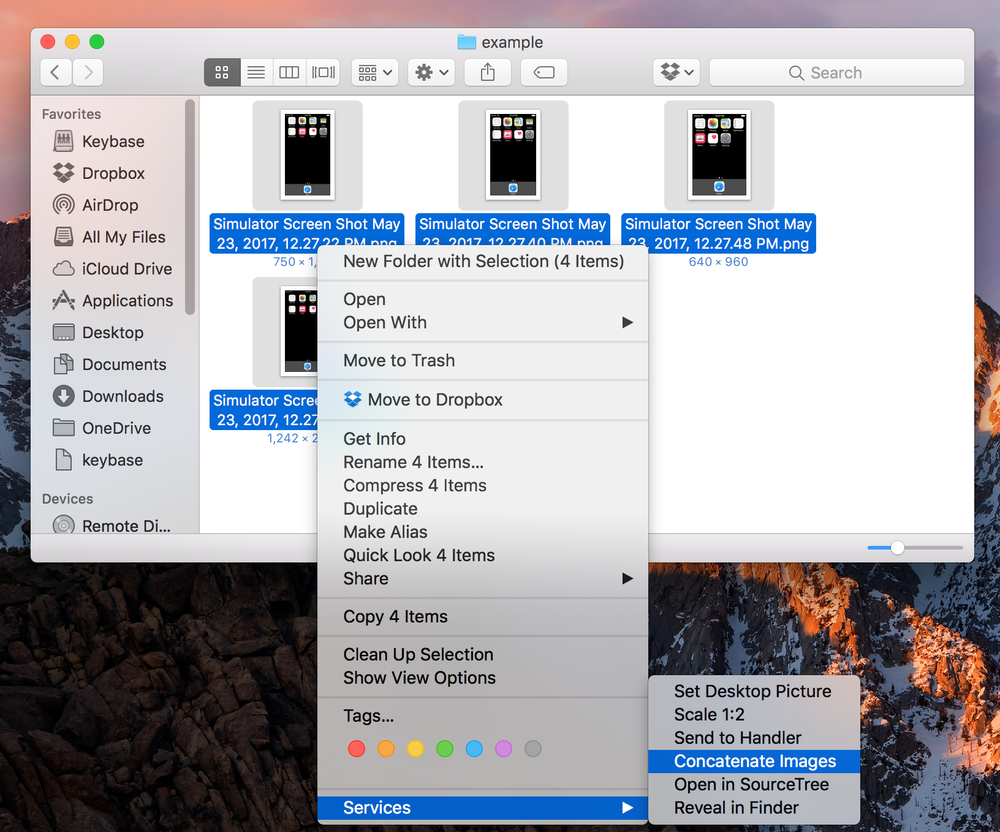
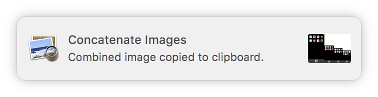
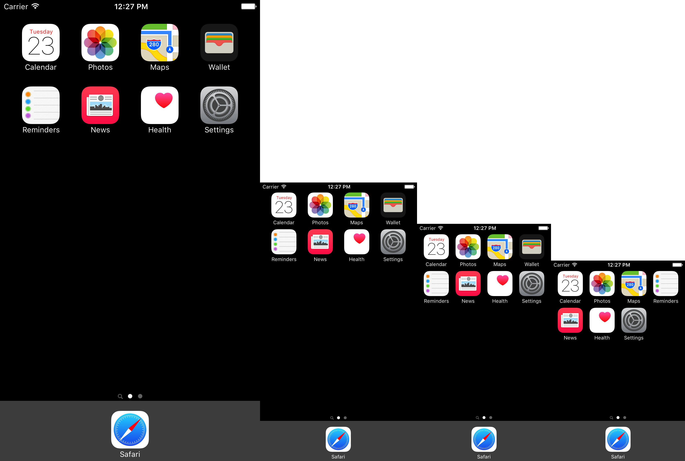

Concatenate Images Automator Workflow
===

An Automator workflow that combines several images into a single file with each image in a row, from largest to smallest. Its original purpose was to put screenshots from iOS simulators of different sizes into one image. This has been super useful to show designers and code reviewers what a UI will look like on all supported devices at once.

Prerequisites
---
This workflow uses `imagemagick` to create the image and `terminal-notifier` to communicate that work is complete.

```bash
brew install imagemagick
brew install terminal-notifier
```

Installation
---
Copy `Concatenate Images.workflow` into `~/Library/Services`. That's it!

Usage
---
Select the images you want to combine in Finder, right click, and select `Concatenate Images` from the `Services` sub-menu. This will take a few seconds, so be patient. A notification will show when the task is complete.

The final image will show all selected images in a horizontal row, in order from largest to smallest, regardless of which order in which the images were selected.

After the workflow completes:
- The final image should be in your clipboard
- The final image will be saved at `/tmp/concatenate-images-output.png`
- Clicking on the notification will open the image from its location in `/tmp`

Example
---
I've taken screenshots of the home screens from simulators for iPhone 4s, iPhone 5, iPhone 6, and iPhone 6s.

Running the workflow:


The notification saying work is complete:


The results:


License
---
[MIT License](LICENSE)
